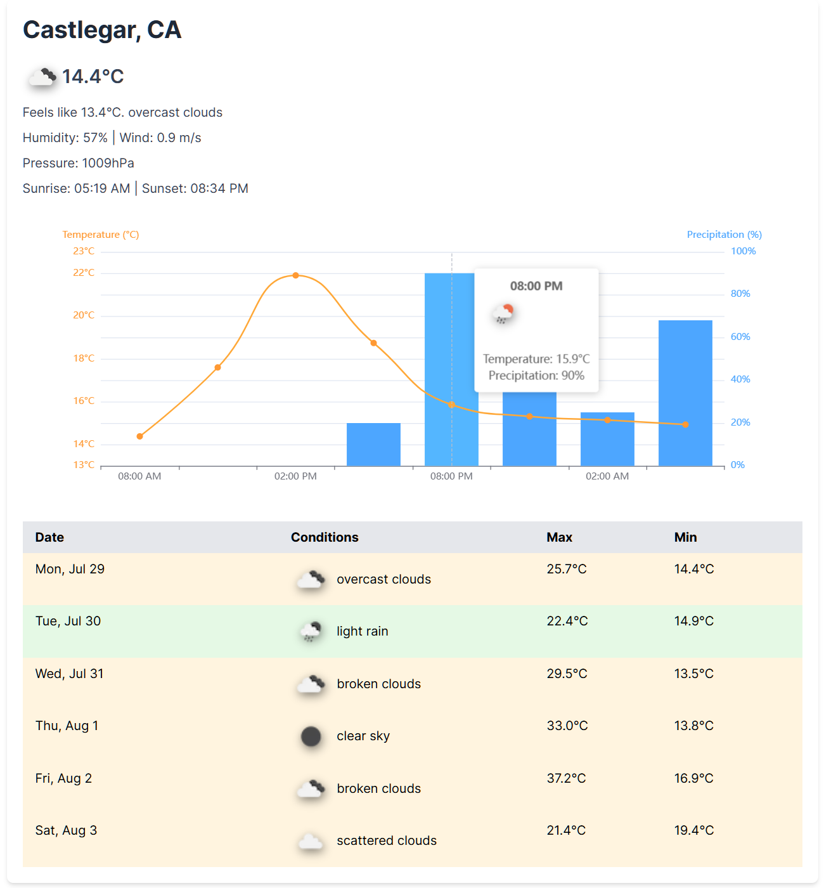

# Weather Forecast App

This is a simple weather forecast application that displays current weather conditions, a 24-hour forecast, and a 5-day forecast for a specified location. It uses the [OpenWeatherMap API](https://openweathermap.org/appid) to fetch weather data and displays it in a barebones Nextjs wrapper.



## Features

- Current weather conditions including temperature, feels-like temperature, humidity, wind speed and direction, pressure, and sunrise/sunset
- 24-hour forecast chart showing temperature and precipitation probability
- 5-day forecast table with high/low temperatures and weather conditions

## Prerequisites

- Node.js (v14 or later recommended)
- Bun runtime
- OpenWeatherMap API key (free tier)

## Setup

1. Clone this repository:

   ```
   git clone https://github.com/yourusername/weather-forecast-nextjs.git
   cd weather-forecast-nextjs
   ```

2. Install dependencies:

   ```
   bun install
   ```

3. Create a `.env.local` file in the project root and add your OpenWeatherMap API key and location:

   ```
   NEXT_PUBLIC_API_KEY=YOUR_API_KEY_HERE
   NEXT_PUBLIC_CITY="Castlegar"
   NEXT_PUBLIC_COUNTRY_CODE="CA"
   ```

## Running the Application

To start the server, run:

```
bun start
```

Then open your browser and navigate to `http://localhost:3000` to view the weather forecast.

## Development

To run the server in development mode with automatic restarts on file changes, use:

```
bun dev
```

## Architecture


## License

This project is open source and available under the [MIT License](LICENSE).
